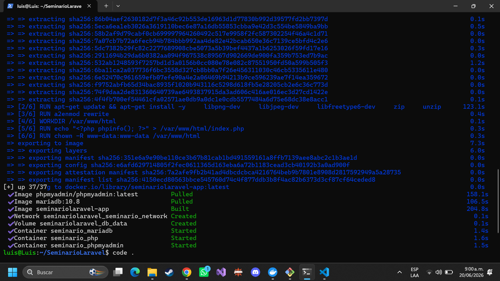
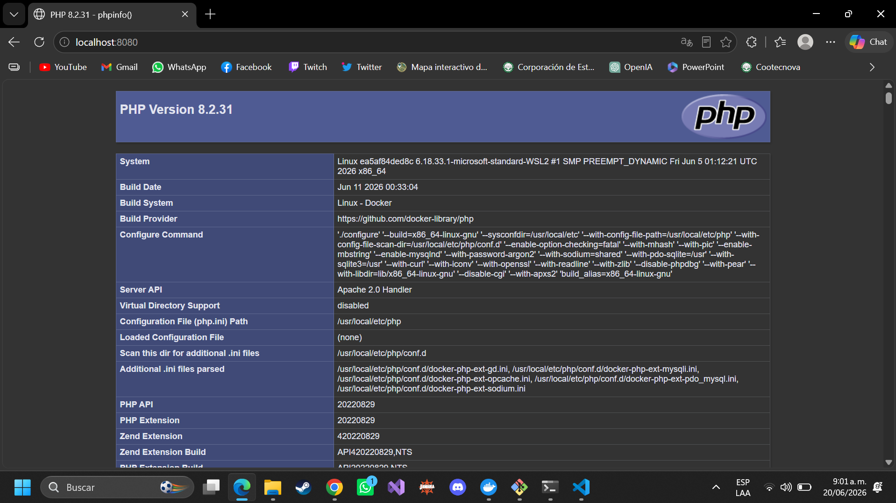
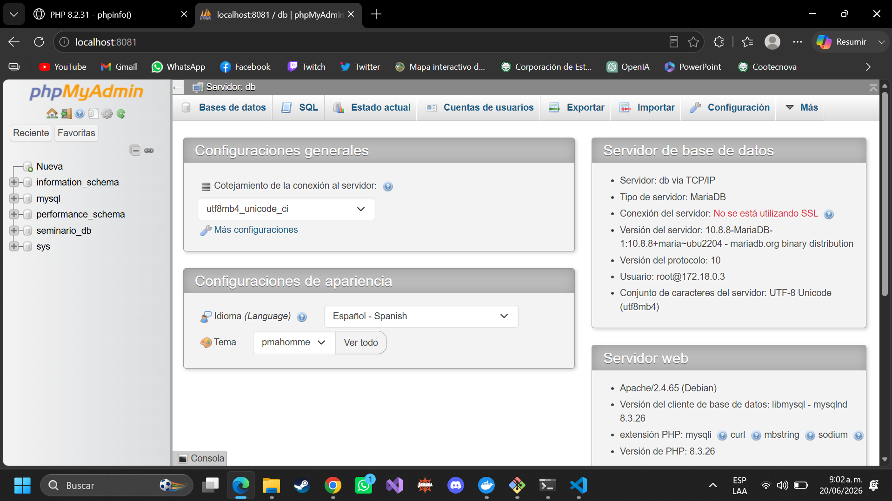
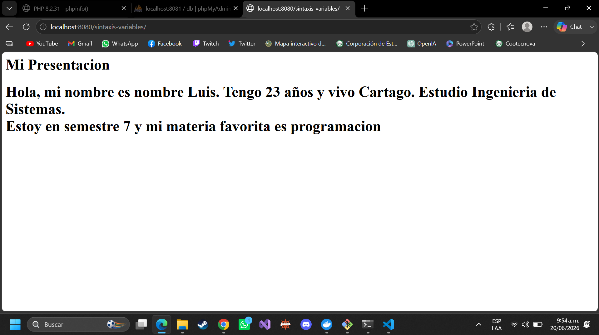

#1. Suba este repositorio a tu cuenta de GitHub (público, agregando al docentecomo colaborador).
#2. Toma una captura de pantalla donde se vea:
##o La terminal mostrando docker-compose up -d exitoso.

##o El navegador en http://localhost:8080 mostrando el phpinfo().

##o El navegador en http://localhost:8081 mostrando el login de phpMyAdmin.

Actividad en Parejas (25 min):
• Enunciado: Modificar el archivo index.php para que, además de los datos actuales, agreguen una variable $semestre (número) y una
variable $materiaFavorita (texto).
• Mostrar un mensaje que diga: "Estoy en [semestre] semestre y mi materiafavorita es [materia]."
